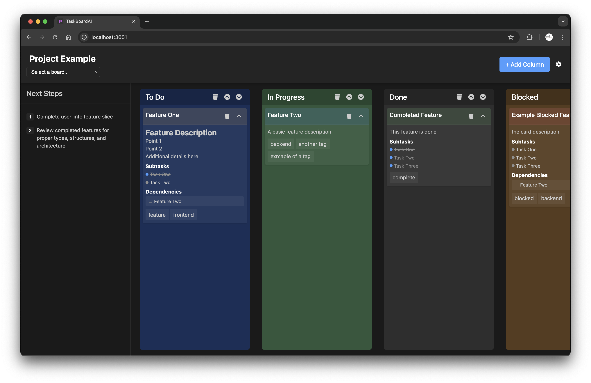

# TaskBoardAI

A lightweight, file-based kanban board designed for AI Agents. 
Includes web interface for HIL collaboration. 

AIX Features: 
- JSON board files to allow for full project context
- MCP Server for access to create/delete/update/read boards

HIL Features: 
- Drag-and-drop sorting of cards and columns
- Add/Delete cards and columns
- Drop down selection of available boards


> It's important to note that there is no ai integration in this project. 
> 
> The board json should be served from your project dir using the CLI
> [See 'Using an External Board Location'](#using-an-external-board-location)
>
> or in your repo's chat using MCP 
> [See 'Using an External Board Location'](#using-an-external-board-location)




## Features

- **Markdown Support**: Rich card content with full markdown syntax
- **Subtasks**: Track and mark completion within cards
- **Tags & Dependencies**: Organize and link related cards
- **Drag and Drop**: Intuitive interface for card management
- **Next Steps**: Track upcoming priorities at the board level
- **Webhooks**: Integrate with other services via webhooks
- **AI Integration**: Connect with Claude for Desktop using MCP

## Installation

1. Clone the repository:
```bash
git clone https://github.com/TuckerTucker/TaskBoardAI.git
cd TaskBoardAI
```

2. Install dependencies:
```bash
npm install
```

## Usage

### Starting a Local Board

1. List available boards:
```bash
./_start_kanban --list
```

2. Create a new board:
```bash
./_start_kanban --new my-project
```

3. Open an existing board:
```bash
./_start_kanban my-project
```

4. Access your board at `http://localhost:3001` (default port)

### Using an External Board Location
_*not yet supported via MCP_

1. Create a new board directory in your project's repo
2. Copy the example board:
```bash
cp /path/to/TaskBoardAI/boards/_kanban_example.json /your/board/location/board_name.json
```

3. Start the server with your external board location:
```bash
./_start_kanban --external /your/board/location/board_name.json
```

## Board Structure

The kanban board is defined in a JSON file with the following structure:
This allows the Agent to have full context of the project

```json
{
  "projectName": "Project Name",
  "columns": [
    {
      "id": "column-id",
      "name": "Column Name",
      "items": [
        {
          "id": "card-id",
          "title": "Card Title",
          "content": "Markdown supported content",
          "collapsed": false,
          "subtasks": [
            "✓ Completed task",
            "Pending task"
          ],
          "tags": ["feature", "frontend"],
          "dependencies": ["other-card-id"],
          "completed_at": "2025-01-19T18:12:35.604Z"
        }
      ]
    }
  ],
  "next-steps": [
    "Next priority task",
    "Future focus area"
  ],
  "last_updated": "2025-01-19T19:20:14.802Z"
}
```

## MCP Server for AI Integration
_[What Is Model Context Protocol (MCP)?](https://modelcontextprotocol.io)_ </br>
TaskBoardAI includes an MCP (Model Context Protocol) server that allows you to create and manage boards using any tools supporting MCP (i.e. Claude Code, Cursor, Windsurf ... ). 

See the documentation for your IDE or CLI tool on how to add MCP servers. 

### Using with Agents

Once configured, you can ask the agent to:
- List all boards: "Show me all my kanban boards"
- Create a new board: "Create a new kanban board called 'Project X'"
- Get a specific board by Name: "Show me the details of Project X"
- Update a board: "Update the Project X board with our progress"
- Delete a board: "Delete the Project X board"

## Webhook Integration

TaskBoardAI supports webhooks for integrating with other services:

1. Create webhook configurations to trigger on events like board updates
2. Test webhook connections through the API
3. Receive real-time updates when changes occur on your boards

## Running Tests

1. Run all tests:
```bash
npm test
```

2. Generate coverage report:
```bash
npm run test:coverage
```

3. Run tests in watch mode (for development):
```bash
npm run test:watch
```

4. Run specific test categories:
```bash
# Run MCP server tests
npm test -- --testPathPattern 'tests/.*mcp'

# Run only unit tests
npm test -- tests/unit

# Run only integration tests
npm test -- tests/integration
```

## Generating Docs

API documentation is automatically generated for each release and available at:
- Latest version: https://tuckertucker.github.io/TaskBoardAI/latest/
- Specific versions: https://tuckertucker.github.io/TaskBoardAI/versioned/[version]/
- Version index: https://tuckertucker.github.io/TaskBoardAI/versions.md

To generate documentation locally:
```bash
# Install dependencies if not already installed
npm install

# Generate docs in docs/api directory
npm run docs
```


## Contributing

Contributions are welcome! Please see [CONTRIBUTING.md](CONTRIBUTING.md) for guidelines.

## License

Apache License 2.0 - See [LICENSE](LICENSE) for details.