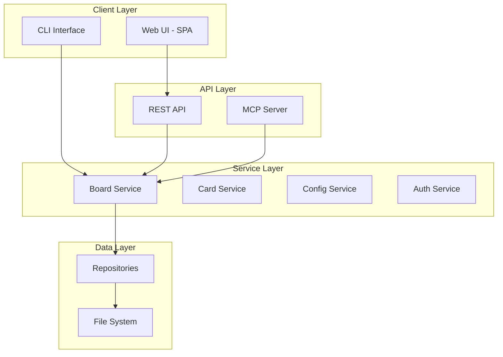

# TaskBoardAI - Comprehensive Overview Analysis Report

## Executive Summary

TaskBoardAI is a modern, file-based kanban board application with AI integration capabilities through the Model Context Protocol (MCP). The project demonstrates a hybrid architecture combining legacy JavaScript components with a progressive TypeScript migration, featuring both web-based and CLI interfaces.

## Project Structure Analysis

### Directory Organization

The repository follows a well-organized modular structure:

```
tkr-kanban/
├── app/                    # Frontend SPA (JavaScript)
│   ├── css/               # Modular CSS architecture
│   ├── js/                # Component-based JS modules
│   └── public/            # Static assets
├── server/                 # Backend services
│   ├── api/               # TypeScript REST API (new)
│   ├── cli/               # Command-line interface
│   ├── core/              # Core business logic (TypeScript)
│   ├── mcp/               # Model Context Protocol server
│   ├── controllers/       # Mixed JS/TS controllers
│   ├── middleware/        # Express middleware
│   ├── models/            # Data models (JavaScript)
│   └── routes/            # API routing
├── tests/                  # Test suite
├── docs/                   # Documentation
└── _planning/             # Architecture planning docs
```

### Key Observations

1. **Hybrid Architecture**: The codebase shows a transition from JavaScript to TypeScript, with newer modules in TypeScript and legacy components in JavaScript.

2. **Separation of Concerns**: Clear separation between frontend (app/), backend (server/), and infrastructure concerns.

3. **Modular Design**: Well-structured modules with clear boundaries, especially in the TypeScript core.

## Architecture Patterns

### Overall Architecture



### Design Patterns Identified

1. **Repository Pattern**: Abstraction layer for data access (BoardRepository, ConfigRepository)
2. **Service Layer Pattern**: Business logic encapsulation (BoardService, CardService)
3. **Factory Pattern**: ServiceFactory for dependency injection
4. **Error Handler Pattern**: Centralized error handling with custom error types
5. **Middleware Pattern**: Express middleware for cross-cutting concerns

### Anti-patterns Detected

1. **Mixed Technology Stack**: JavaScript and TypeScript coexistence creates maintenance complexity
2. **Duplicate Implementations**: Both JS and TS versions of similar functionality
3. **Inconsistent Error Handling**: Mix of error handling approaches between legacy and new code

## Technology Stack

### Core Technologies

- **Runtime**: Node.js (>=16.0.0)
- **Languages**: JavaScript, TypeScript (5.8.3)
- **Web Framework**: Express.js (4.21.2)
- **Build Tools**: TypeScript Compiler, Jest, Babel
- **Package Manager**: npm

### Key Dependencies

1. **API/Web**:
   - Express.js - Web framework
   - CORS - Cross-origin resource sharing
   - Helmet - Security headers
   - Express Rate Limit - API rate limiting

2. **AI Integration**:
   - @modelcontextprotocol/sdk - MCP implementation

3. **Data Validation**:
   - Zod - Schema validation

4. **CLI Tools**:
   - Commander - CLI framework
   - Inquirer - Interactive prompts
   - Chalk - Terminal styling
   - Ora - Loading spinners

5. **Utilities**:
   - UUID - Unique identifiers
   - Marked - Markdown parsing
   - Axios - HTTP client

### Development Dependencies

- TypeScript ecosystem (@types/*, typescript)
- Testing: Jest, Supertest
- Documentation: JSDoc, better-docs
- Linting: ESLint with TypeScript support

## Data Flow Architecture

### API Endpoints

The system exposes RESTful endpoints:

```
/api/boards       - Board CRUD operations
/api/cards        - Card management
/api/columns      - Column operations
/api/config       - Configuration management
/api/webhooks     - Webhook integration
/health           - Health checks
/metrics          - Application metrics
```

### State Management

1. **Frontend**: Component-based state management (state.js)
2. **Backend**: File-based persistence with in-memory caching
3. **Data Format**: JSON files for board storage

### Database Schema

File-based storage using JSON:

```typescript
Board {
  id: string
  title: string
  columns: Column[]
  cards: Card[]
  settings: BoardSettings
  createdAt: string
  updatedAt: string
}
```

## Project Health Indicators

### Code Metrics

- **Total Files**: 142 JavaScript/TypeScript files
- **Lines of Code**: ~32,000 LOC
- **Test Coverage**: 15 test files (unit + integration)
- **Language Distribution**: Mixed JS/TS (approximately 60/40)

### Positive Indicators

1. **Well-structured Documentation**: Clear README, API docs, board format specs
2. **Comprehensive Testing**: Unit, integration, and benchmark tests
3. **Modern Tooling**: TypeScript, Jest, ESLint configuration
4. **Security Considerations**: Rate limiting, CORS, Helmet integration
5. **Version Control**: Semantic versioning (currently 1.4.1)

### Areas for Improvement

1. **Test Coverage**: Limited test files relative to codebase size
2. **TypeScript Migration**: Incomplete migration creates maintenance overhead
3. **Documentation Gaps**: Limited architectural documentation
4. **Build Optimization**: No production build configuration evident

## Maintainability Analysis

### Strengths

1. **Modular Architecture**: Clear separation of concerns
2. **Type Safety**: Progressive TypeScript adoption
3. **Error Handling**: Structured error types and handlers
4. **Configuration Management**: Centralized configuration
5. **CLI Tools**: Well-designed command-line interface

### Challenges

1. **Technology Debt**: Mixed JS/TS codebase
2. **Duplicate Code**: Similar functionality in different implementations
3. **Complex Dependencies**: 41 direct dependencies
4. **Migration Complexity**: Ongoing refactoring efforts

## Architecture Decisions and Trade-offs

### Key Decisions

1. **File-based Storage**: Simple, portable, but limited scalability
2. **MCP Integration**: Future-proof AI integration
3. **SPA Frontend**: Modern UX but requires JavaScript
4. **Modular CSS**: Maintainable styling approach

### Trade-offs

1. **Simplicity vs. Scalability**: File storage limits multi-user scenarios
2. **Migration vs. Stability**: TypeScript migration adds temporary complexity
3. **Feature-rich vs. Lightweight**: Balance between functionality and simplicity

## Scalability Considerations

### Current Limitations

1. **File-based Storage**: Single-writer limitation
2. **No Database**: Limits query capabilities
3. **In-memory State**: Memory constraints for large boards

### Scalability Path

1. **Database Migration**: Path to PostgreSQL/MongoDB evident in planning
2. **API Versioning**: REST API structure supports versioning
3. **Caching Layer**: Repository pattern enables caching implementation
4. **Horizontal Scaling**: Stateless API design supports scaling

## Security Considerations

### Implemented Security

1. **Rate Limiting**: API request throttling
2. **CORS Configuration**: Controlled cross-origin access
3. **Helmet Integration**: Security headers
4. **Input Validation**: Zod schema validation

### Security Gaps

1. **Authentication**: Basic auth implementation, needs enhancement
2. **Authorization**: Limited role-based access control
3. **Data Encryption**: No encryption at rest

## Recommendations

### Immediate Actions

1. **Complete TypeScript Migration**: Prioritize converting remaining JS files
2. **Increase Test Coverage**: Target 80% code coverage
3. **Documentation Update**: Create architectural decision records

### Medium-term Improvements

1. **Database Integration**: Implement proper database backend
2. **API Versioning**: Implement versioned endpoints
3. **Performance Monitoring**: Add APM integration
4. **CI/CD Pipeline**: Automate testing and deployment

### Long-term Considerations

1. **Microservices Architecture**: Consider service decomposition
2. **Event-driven Architecture**: Implement event sourcing for audit
3. **Multi-tenancy**: Design for SaaS deployment
4. **Real-time Collaboration**: WebSocket integration for live updates

## Conclusion

TaskBoardAI demonstrates solid architectural foundations with clear separation of concerns and modern development practices. The ongoing TypeScript migration and modular design position it well for future enhancements. Key focus areas should be completing the TypeScript migration, improving test coverage, and planning for scalability through database integration.